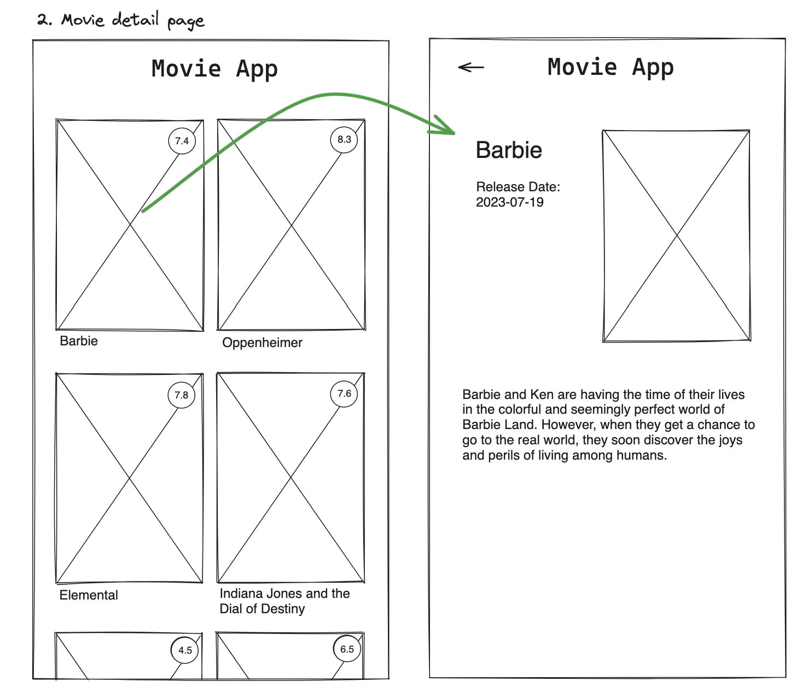

# Title

<strong>The App Movie </strong>

## Value Proposition

As a user  
I want to view detailed information about a movie  
so that I can learn more about the movie before deciding to watch it  

## Description

## Acceptance Criteria

- Users should be able to see a list of movies with titles, posters, release years and a rating score.
- Users should be able to click on a movie card to open a detailed view.
- The detailed movie card should display the movie title, poster, release date, and a short plot summary.

## Tasks

- Display a list of movies with titles, posters, and release years.
- Implement the functionality to open a detailed movie card when a movie is clicked.
- Create a function to fetch and display detailed movie information
